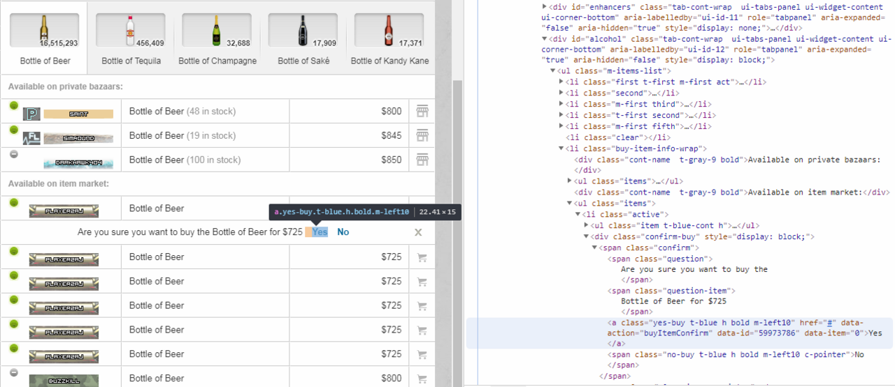

Tampermonkey tutorial
----------

In this script we're going to try and make something that saves 1 click  on the item market and automatically presses the buy button for us.

To get started with creating a tampermonkey script the first thing to do is create a new script while on the web page you're interested in. This should give you something like this

```javascript
// ==UserScript==
// @name         New Userscript
// @namespace    http://tampermonkey.net/
// @version      0.1
// @description  try to take over the world!
// @author       You
// @match        https://www.torn.com/index.php
// @grant        none
// ==/UserScript==

(function() {
    'use strict';

    // Your code here...
})();

```

The top section is used by tampermonkey to decide how the script should run. The only part we care about is the @match directive which says which pages this script should run on. For our purposes we only want it on the item market page.

The second part is the function which helpfully tells you to put your code there. This is the entry point for our script and gets called after the page loads. Be careful here, just because the page is loaded doesn't mean it has loaded all the data it needs yet. We'll come back to that later.

To make sure everything is working add a log 

```javascript
(function() {
    'use strict';

    console.log("It's working");
})();
```

If you save this and reload you should see a line in the logs like:

```
It's working        userscript.html?id=9d4feb9f-65b4-40eb-b7b1-1369e8f5d303:18
```

Hooray! Your script is running and executing correctly. Logs are a great way to see what's going on in your script so if something isn't making sense throw a log in to see what's going on.

Functions are a great way to organise code and explain what it does. So let's create an empty function to do what we want.

```javascript
function findAndClickBuyButton() {
    //Put code here to make it work
}
```

The function name describes what it does so when someone reads the code they don't have to understand it. In order to find the buy button we'll use document.querySelector() to find it. We can find the selector using the chrome inspector. 



```javascript
function findAndClickBuyButton() {
    let buyButton = document.querySelector("a.yes-buy.t-blue");
    if (!buyButton) {
        return; //We didn't find the button so give up.
    }
}
```

There's a few things going on here. ```let buybutton``` defines a variable called buyButton. We assign the value we get from the query and then use ```if(!buyButton)``` to make sure we found something. Otherwise we return to exit the function.

So now that we have the button the next thing to do is to click it.

```javascript
function findAndClickBuyButton() {
    let buyButton = document.querySelector("a.yes-buy.t-blue");
    if (!buyButton) {
        return; //We didn't find the button so give up.
    }
    buyButton.click();
}
```

Yeah, that's all there is to it and our little function is complete. But right now nothing is calling the function. We need to add something in our entry function to call ```findAndClickBuyButton```. But remember from the start that I said the entry function only gets called on page load, but the buy button won't be visible until the item is chosen. For this we'll use the ```setInterval``` function which executes another function repeatedly after a set time.

```javascript
(function() {
    'use strict';

    console.log("It's working");
    setInterval(findAndClickBuyButton,200); //Check for buy buttons every 200ms    
})();
```

At this point everything should work and you can now buy items 50% faster.